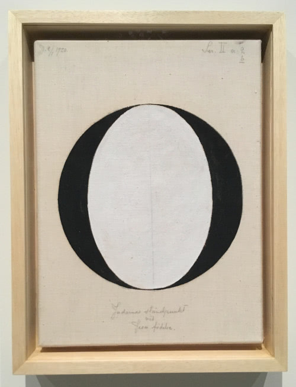
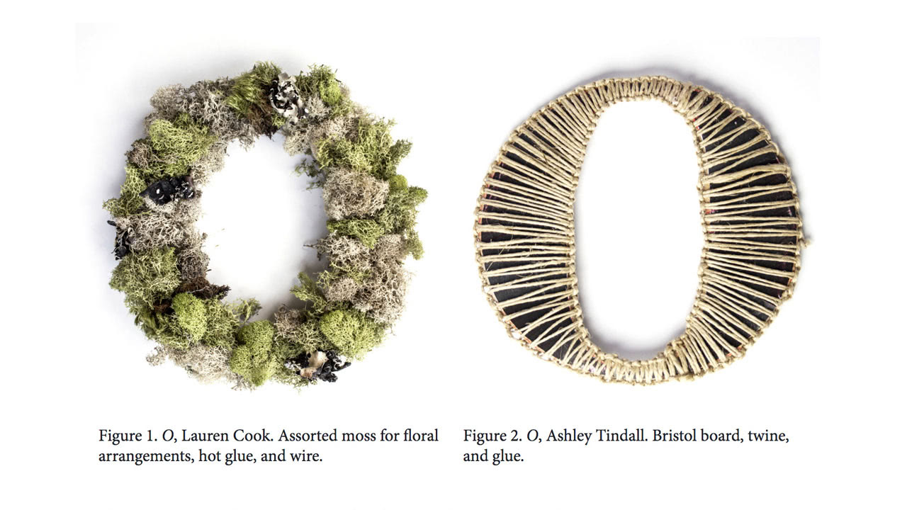

# Bespoke Character & Description

>90 percent of design is typography. And the other 90 percent is whitespace.
>
>—[Jeffrey Zeldman](https://twitter.com/zeldman/status/679727437198929921)

<cite>[Hilma af Klint](https://www.hilmaafklint.se/en/), Atom Series, 1919</cite> (via [coa.edu](https://www.coa.edu/live/profiles/1107-catherine-clinger/templates/details/faculty.php))

**Alt text description:** `A large painted black serif capital letter O with a white oval center on an off-white background.`

> Alternative text should be succinct, yet descriptive of the content and function of an image. Lengthy alternative text (more than around 100 characters) often indicates that extraneous content or content that is not available to sighted users is being presented.
>
>[Perceivable](https://webaim.org/standards/wcag/checklist#perceivable) guidline via WebAIM’s WCAG 2 Checklist

## Brief

1. Design a bespoke character; working from the Latin alphabet, choose a single letterform from A through Z using any style (lowercase or uppercase, sans-serif or serif, cursive or fantasy, etc.) and technique (analog or digital).
2. Write a concise, accessible, and semantic alternative text description of the final letterform design in under 100 characters.
    - For example: A large painted black serif capital letter O with a white oval center on an off-white background.
3. Also consider text for a caption: Letter, designer, and a list of materials or process.
    - For example: *O*, Lauren Cook. Assorted moss for floral arrangements, hot glue, and wire.

### Details

#### Artwork

Capture and save final artwork in a digital format using these guidlines:

- Size: Use a square with a width and height of `1080 px` × `1080 px` (think Instagram artwork size).
- Format: If it’s a photo, save as a JPG; and if it’s *not* a photo, save as a PNG.
- Name: Use a meaningful filename and in lowercase.
  - For example: `capital-letter-o.jpg`

## Examples

Analog student work from <cite>[Experimental A–Z, 0–9](https://educators.aiga.org/wp-content/uploads/2013/12/hester)</cite> taught by [Cassie Hester](https://experimentaltypography.com/) and [Joey Hannaford](http://www.joeyhannaford.com).

## Readings

### Alt Text

- [Alt text is part of your site’s content](https://www.centercentre.com/2016/06/30/2016-06-30-alt-text-is-part-of-your-sites-content/)
- [When writing alt text, ask yourself this question](https://www.centercentre.com/2016/06/09/2016-06-09-when-writing-alt-text-ask-yourself-this-question/)
- [Alt-texts: The Ultimate Guide](https://axesslab.com/alt-texts/)
- [alt attributes like paragraphs](https://daverupert.com/2020/09/alt-attributes-like-paragraphs/)
- [Rethinking Accessible Drop Caps: Pattern](https://justingagne.design/words/rethinking-accessible-drop-caps/#pattern)
- [Include descriptive titles, captions, filenames, and text for images](https://support.google.com/webmasters/answer/114016?hl=en#descriptive-titles-captions-filenames)

### Design

- [What is a Design Language… really?](https://medium.com/thinking-design/what-is-a-design-language-really-cd1ef87be793)

### Typography

- [Web Design is 95% Typography](https://ia.net/topics/the-web-is-all-about-typography-period)
- [Typography Deconstructed: Type Glossary](https://typedecon.com/blogs/type-glossary)

## Tools

- [Hemingway Editor](http://www.hemingwayapp.com)

## Tutorials

- [Writing Effective and Accessible Alt Text](https://thegymnasium.com/take5/writing-effective-and-accessible-alt-text)
- [Improving Image Accessibility With Alt Text](https://thegymnasium.com/take5/improving-image-accessibility-with-alt-text)

## Vocabulary

- **Alt text**
  - Short for *alternative* text. Alternative text provides a descriptive textual alternative to non-text content such as images and charts in web pages and digital publishing formats.
- **Accessible**
  - Easily understood; approachable. Accessible content that’s friendly and usable by as many people as possible.
- **Bespoke**
  - Handmade; made by hand. Bespoke typefaces and typographic designs.
- **Semantic**
  - Meaningful; relating to the meaning of a word, phrase, sentence, or text. Semantic markup is HTML that introduces meaning to web page content rather than just visual presentation.
